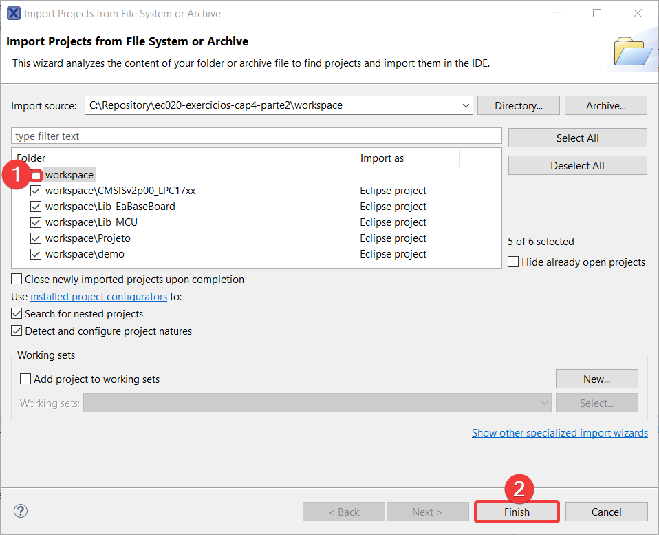

# ec020-exercicios-cap4-parte2

## 1. Importar o workspace  
Importar a pasta `workspace` como workspace no MCUXpresso IDE já aberto (`File` -> `Switch Workspace` -> `Other`), ou na primeira inicialização (selecione a pasta `workspace` desse repositório).

## 2. Importar os projetos
Clique em `File` -> `Open Projects from File System...`, clique em `Directory`, navegue para pasta `workspace` e selecione-a e por fim siga os passos da imagem abaixo.

## 3. Buildar as dependências
Antes de rodar o `Projeto`, certifique-se de selecionar o projeto `demo` e clicar em `Build` (No painel `Quickstart Panel` que fica no lado inferior esquerdo da tela) para gerar os arquivos necessários para o `Projeto`.